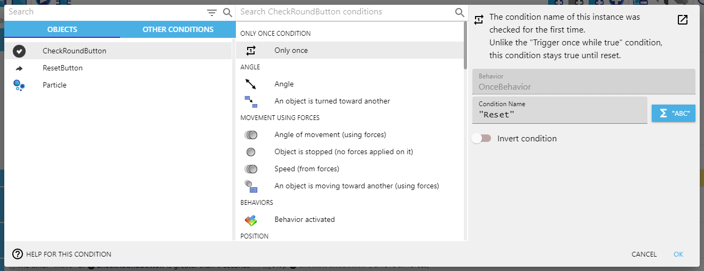
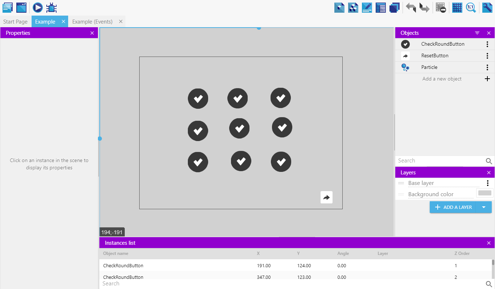
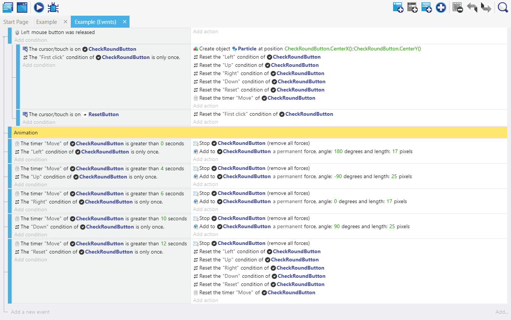

# "Trigger Once Condition For Object" GDevelop Extension
This extension has been renamed. (Old: Only Once Condition For Object)  
The new file name is "TriggerOnceConditionForObject0.0.0.json".
## Summary
This extension is useful if you want to trigger once per instance.  
This is simpler than creating your own instance variables.

## How to use: 
- Adding the **Trigger Once Condition** behavior to an object.  
- In the events add the **Trigger once per instance** condition to the instance.

The condition will be identified by the **condition name** and will be executed only once until you reset if you want using it one more time.  
Unlike the "Trigger once while true" condition, this condition stays false until reset manually with the appropriate action.

This extension add:

- **Trigger Once Condition** - behavior
- **Trigger once per instance** - condition
- **Reset all conditions** - action
- **Reset condition** - action

